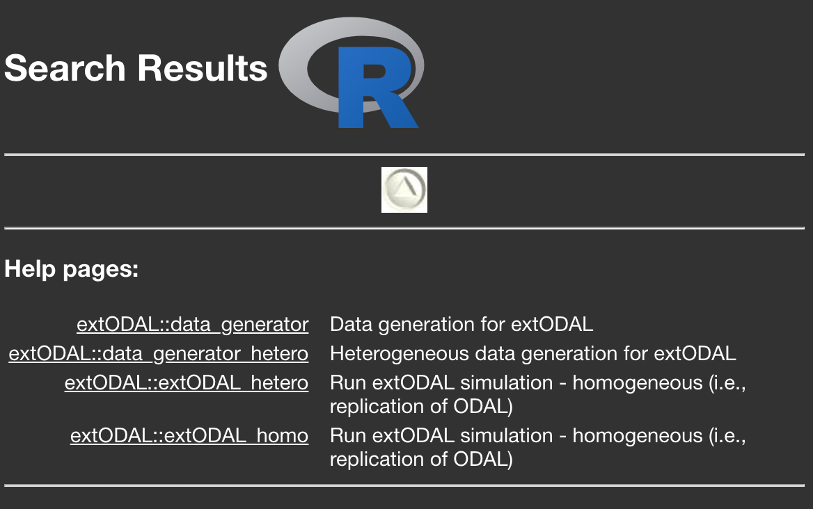
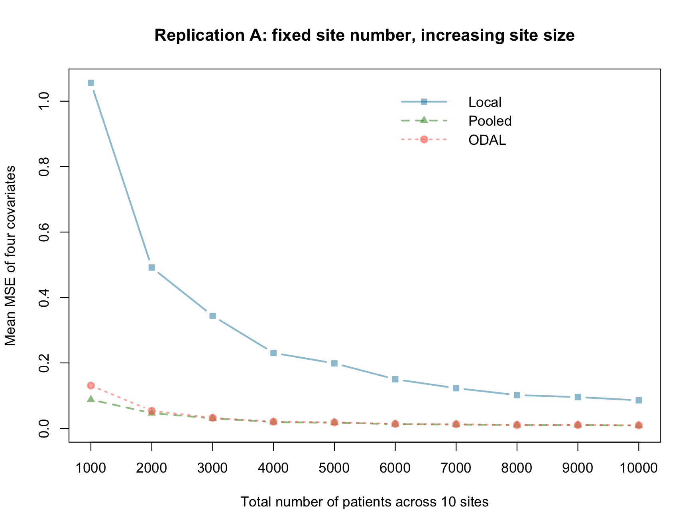
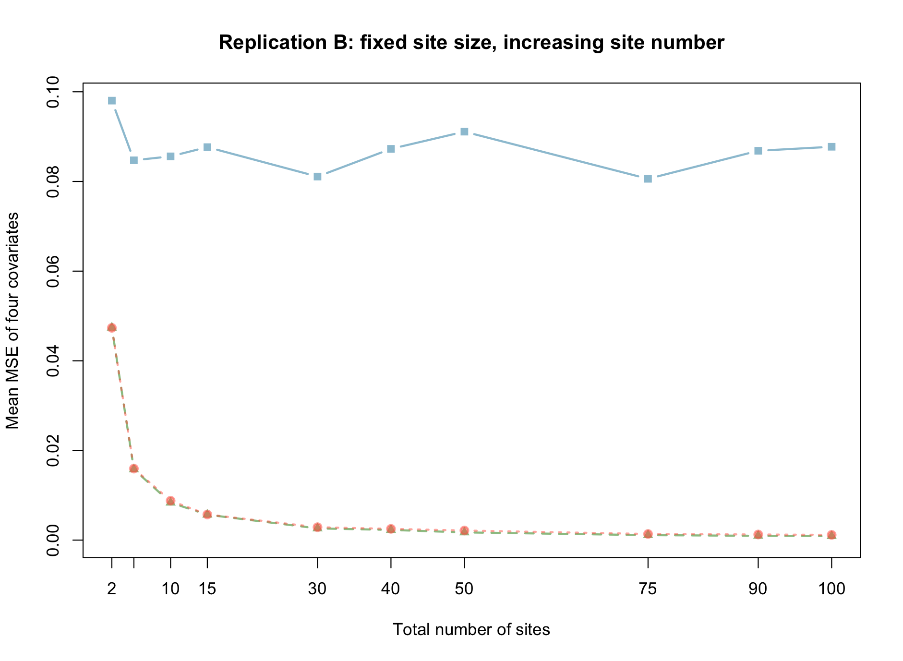
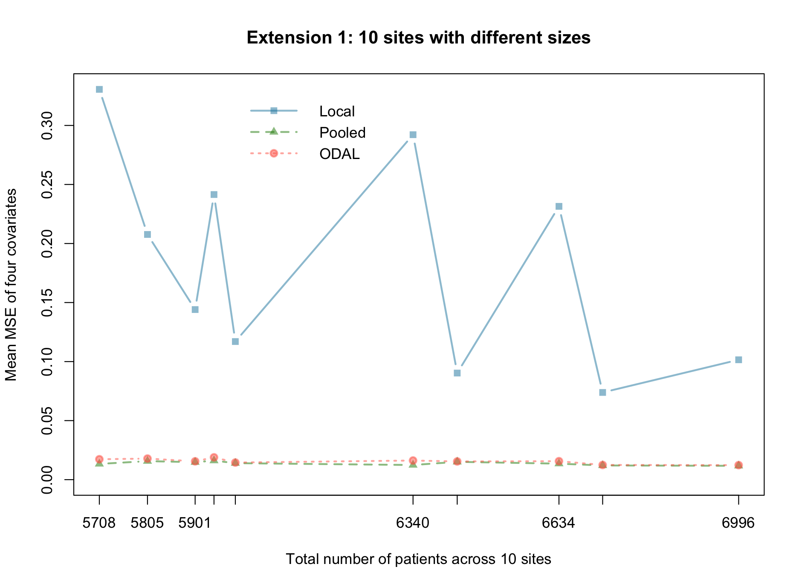
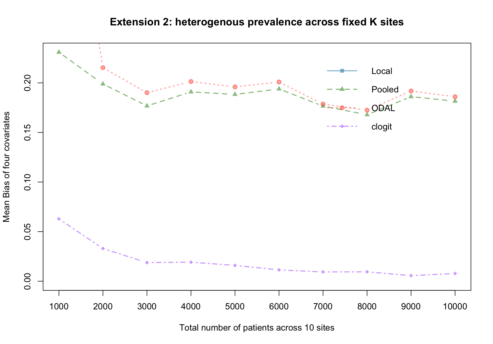

# I. Reproducibility

## 1.1 Install R package `extODAL` from Github page
```{r section_1.1, message = FALSE, eval=FALSE}
# install.packages("devtools")
library(devtools) 
# github page: https://github.com/JiayiJessieTong/extODAL
install_github("JiayiJessieTong/extODAL", force = TRUE)
library(extODAL)
# help page:
??extODAL
```

The help page of `extODAL` R package in Rstudio looks like this:

<center>

{width=40%}

</center>

There are four functions in the `extODAL` R package, including `data_generator`, `data_generator_hetero`, `extODAL_hetero`, `extODAL_homo`. The main function to replicate the simulation in ODAL paper is `extODAL_homo`; the main function to conduct the extension of the ODAL paper is `extODAL_hetero`. The usage details are introduced in the following sections. In these functions, `if else` and `tryCatch()` are used to make sure that the function can handle the potential errors in the inputs/arguments and each replicate simulation. Additionally, the simulation in parallel works for both Mac and Windows. 

Note*: this package passes all checks by R CMD check extODAL_1.0-0.tar.gz in terminal, except only 1 NOTE, which is for the .travis.yml file. This .travis.yml file is used for travis-ci check on GitHub. This package passes the Travis CI pass: https://github.com/JiayiJessieTong/extODAL/runs/2539430834. 

## 1.2 Replicate simulation with `extODAL_homo` 

First, let's replicate setting A and B of the simulation study in the ODAL paper by calling function `extODAL_homo`.

### 1.2.1 Not parallelized version:
In particular, to run simulation setting A, we can set the arguments `setting = "A"`. Argument `Nsim` is the total number of iterations to be ran in the simulation, which takes any integer. To be noted here, larger value of `Nsim` would take longer computing time. Argument `plotit` can take value TRUE or FALSE, and the default value is TRUE. If `plotit = "TRUE"`, a plot as Figure 2 in the ODAL paper will be created. 

```{r section_1.2_A, message = FALSE, eval=FALSE}
# setting A
extODAL_homo(Nsim = 50, setting = "A")
```

Similarly, we can set `setting = "B"` to replicate the setting B in the ODAL paper. 

```{r section_1.2_B, message = FALSE, eval=FALSE}
# setting B
extODAL_homo(Nsim = 50, setting = "B")
```

### 1.2.2 Parallelized version:

The `extODAL_homo` function also provides an option to run the simulation replicates in parallel. By setting the argument `parallel_run = TRUE`, we can run the simulation in parallel using half of the total logical cores on the machine (the default is FALSE). For example, on my own desktop, the total number of logical cores is 16 (by calling `detectCores()` in the `parallel` R package). By setting the argument `parallel_run = TRUE`, 8 logical cores are used to run the simulation in parallel. Especially, to run the simulation replicates in parallel, we can use the following code for setting A and setting B, respectively:
```{r section_1.2_parallel, message = FALSE, eval=FALSE}
# setting A
extODAL_homo(Nsim = 50, setting = "A", parallel_run = TRUE)
# setting B
extODAL_homo(Nsim = 50, setting = "B", parallel_run = TRUE)
```

## 1.3 Simulation extension with `extODAL_hetero`

In addition to the replication, we also conducted two extensions of the ODAL simulation. `extODAL_hetero` function is used to conduct these two extensions.

### 1.3.1 Not parallelized version:

Similar as the function introduced above, `extODAL_hetero` takes four arguments, including `Nsim` (total number of iterations), `setting` ("1" or "2"), `parallel_run` (TRUE or FALSE), and `plotit` (TRUE or FALSE). The R code is as follows:

```{r section_1.3_notParallel, message = FALSE, eval=FALSE}
# extension 1
extODAL_hetero(Nsim = 50, setting = "1")
# extension 2
extODAL_hetero(Nsim = 50, setting = "2")
```

### 1.3.2 Parallelized version:

To run the simulation in parallel, we can set the argument `parallel_run = TRUE`. 
```{r section_1.3_parallel, message = FALSE, eval=FALSE}
# extension 1
extODAL_hetero(Nsim = 50, setting = "1", parallel_run = TRUE)
# extension 2
extODAL_hetero(Nsim = 50, setting = "2", parallel_run = TRUE)
```

# II. Introduction

## 2.1 ODAL algorithm

ODAL is a one-shot distributed algorithm to perform logistic regression models with the data from multiple clinical sites (@duan2018odal). By constructing a surrogate likelihood which approximates the target likelihood function (i.e., full likelihood across all sites), the ODAL algorithm improves the estimation of the association study without requiring patient-level data neither iterative communications across sites. To evaluate the ODAL algorithm, the authors of the ODAL paper conducted simulation study under various settings. In this report, we mainly focus on the replication of setting A and B from the ODAL paper. 

## 2.2 ODAL simulation and its extension

In the simulation study of the ODAL paper, the authors set all of the clinical sites have the same size population. However, this is not the case in the real-world setting. Thus, to relax this setting, the first extension we did was to set different numbers of patients in the clinical sites. This change won't affect performance of the proposed ODAL algorithm, so we was expecting to have similar results/plots as seen in the ODAL paper. 

Another assumption made in the ODAL algorithm is that the population of all clinical sites are homogeneous. However, this assumption is not practical when we apply it to the real-world data. Thus, in the second extension, we extended the simulation to a heterogeneous setting (i.e., the disease prevalence values across the clinical sites are different. In other words, in the logistic regression model, the intercepts are different for the clinical sites.)


# III. Methods

To replicate and evaluate the empirical performance of the ODAL method, we consider the setting where a binary outcome is associated with two continuous risk factors and two binary risk factors. All of the four factors are independent from each other. One of the continuous covariates is generated from a standard normal distribution $N(0, 1)$ and the other is generated from a uniform distribution $U(0,1)$. The two binary covariates are generated from Bernoulli distributions with probability 0.35 and 0.6 respectively. 

In the following simulation, we set the true values of the coefficients are $(1,-1,1,-1)$. Except \textit{Extension 2} (details will be introduced in section 3.2.2), all other settings have the true value of the intercept $1$. The logistic regression model is as follows:

$$
logit(Pr(Y = 1 |x)) = 1 + 1*x_1 - 1*x_2 + 1*x_3 - 1 * x4
$$
where $logit(p) = log(p/(1-p))$. 

## 3.1 ODAL simulation settings (replication)

In this simulation study, the ODAL algorithm was compared to two methods: (1) the pooled estimator (i.e., also treated as the gold standard by assuming all of the patient-level data are available); (2) the local estimator (i.e., fit the logistic regression model above with the patient-level data from the local site).

### 3.1.1 Setting A

There are 10 clinical sites in total (i.e., total number of sites is fixed). In each site, we set the population size to be 100 to 1000 (i.e., the total number of patients across 10 sites is 1000 to 10000). In other words, all of the sites have the same number of patients. There are 10 sub-settings in total. 

### 3.1.2 Setting B

We fixed the population in each site to 1000. The number of sites ranges from 2 to 100. Especially, the number of sites equals to 2, 5, 10, 15, 30, 40, 50, 75, 90, and 100. Thus, the total number of patients across all sites ranges from 2000 to 100000. 

## 3.2 ODAL extension simulation settings

### 3.2.1 Extension 1

In this extension, the ODAL algorithm was compared to the same two methods as in Section 3.1. Similar to 3.1.1, we fixed the total number of sites to be 10. The number of patients in each site was randomly sampled from 200 to 1000.  

### 3.2.2 Extension 2

In this extension, the ODAL algorithm was compared with three methods. In addition to the two aforementioned methods, the conditional logistic regression model was also compared. The conditional logistic regression model is an extension of the conventional logistic regression model. It allows us to cancel out the intercept of the logistic regression model by conditioning on the number of cases in each stratum. Specifically, the conditional likelihood for one pair of observations can be written as:

\begin{align}
& \mathbb{P}(Y_{i1} = 1, Y_{i2} = 0 | X_{i1}, X_{i2}, Y_{i1} + Y_{i2} = 1) \\
& = \frac{\mathbb{P}(Y_{i1} = 1|X_{i1})\mathbb{P}(Y_{i2} = 0|X_{i2})}{\mathbb{P}(Y_{i1} = 1|X_{i1})\mathbb{P}(Y_{i2} = 0|X_{i2}) + \mathbb{P}(Y_{i1} = 0|X_{i1})\mathbb{P}(Y_{i2} = 1|X_{i2})}\\
& = \frac{\frac{exp(\alpha_i + \beta^TX_{i1})}{1 + exp(\alpha_i + \beta^TX_{i1})} \times \frac{1}{1 + exp(\alpha_i + \beta^TX_{i2})}}{\frac{exp(\alpha_i + \beta^TX_{i1})}{1 + exp(\alpha_i + \beta^TX_{i1})} \times \frac{1}{1 + exp(\alpha_i + \beta^TX_{i2})} + \frac{1}{1 + exp(\alpha_i + \beta^TX_{i1})} \times \frac{exp(\alpha_i + \beta^TX_{i2})}{1 + exp(\alpha_i + \beta^TX_{i2})}} \\
& = \frac{exp(\beta^{T}X_{i1})}{exp(\beta^{T}X_{i1}) + exp(\beta^{T}X_{i2})}
\end{align}

where $Y_{ij}$ denotes the label (e.g. case status) of the j-th observation of the i-th stratum/site, $\alpha_i$ is the site-specific intercept, and $\beta$ is the parameter of interest. $\alpha_i$ (i.e. intercept, prevalence of disease) is canceled out by conditioning on the cases. 


In Section 2.2, we talked about that to relax the assumption of the data homogeneity, we extended the simulation to a heterogeneous setting (i.e., the disease prevalence values across the clinical sites are different. In other words, in the logistic regression model, the intercepts are different for the clinical sites). The mean prevalence value across all sites is 1. To make the value heterogeneous, random numbers generated from uniform distribution U(-2, 0) are added to the mean prevalence value 1. These values are then used as the true value for intercepts. By using the conditional logistic regression model on this heterogeneous data (i.e., heterogeneity in the prevalence), we can get more accurate estimation of the coefficients compared with the pooled estimator, ODAL estimator, and local estimator. The conditional logistic regression model was fit with `clogit()` function from the \textit{survival} package.

# IV. Results

## 4.1 ODAL simulation results (replication)

### 4.1.1 Setting A

<center>

{width=70%}

</center>

From Figure 2, we can observe that when the size number is fixed (i.e., K = 10), increasing the site size will decrease the mean MSE. The decrease of the MSE is caused by the increasing sample size, which contributes to more accurate estimation of the coefficients in the association study compared with using smaller sample size. From the above figure, we can obverse that the ODAL can reach almost the same accuracy as the pooled estimator when total sample size is relatively large. Using `benchmark()` function in library \textit{rbenchmark}, the mean running time for 1 iteration with 50 replications in benchmark is 0.30 secs and sd is 0.023 secs (code as below). Similarly, by setting `parallel_run = TRUE`, the mean running time is 2.87 secs and sd is 0.07. We can see that although the parallelization is used, the running time not decreases even increases. This is because we only run on 1 iteration and the parallelization is on multiple iterations. In other words, distributing the task into different cores takes time, leading to increasing running time of running only 1 iteration of the simualtion. Thus, in order to see the advantage of the parallelization, we need to run multiple iterations instead. This pattern is the same for all of the following settings. 

```{r, eval=FALSE}
time = c()
for (i in 1:50){
  result = benchmark(extODAL_homo(Nsim = 1, setting = "A", plotit = FALSE), 
                     replications = 1)
  time[i] = result$elapsed
}
mean(time); sd(time)
```


### 4.1.2 Setting B

<center>

{width=70%}

</center>

From Figure 3, we can observe that when the size site is fixed (i.e., n=1000), increasing the site number will decrease the mean MSE. The decrease of the MSE is also caused by the increasing sample size. From the above figure, we can obverse that the ODAL can reach almost the same accuracy as the pooled estimator when total sample size is relatively large. In other words, borrowing information from more sites increases the accuracy of estimation.


## 4.2 ODAL extension simulation results

### 4.2.1 Extension 1

<center>

{width=70%}

</center>

In this extension, we set the 10 sites to have different sizes. From Figure 4, we can observe the same pattern as Figure 2 and Figure 3. When the total sample size increases and is relatively large, the estimation accuracy of the ODAL algorithm can be almost the same as the pooled analysis. 


### 4.2.2 Extension 2


<center>

{width=70%}

</center>

In this extension, we relax the assumption on the homogeneity of the population across sites. We set different prevalence values (i.e., intercept) for different sites. The conditional logistic regression model is a good fit to take the heterogeneous prevalence rate into account. Thus, in this extension, we compared four methods. From Figure 4, both of ODAL methods and the pooled analysis have relatively larger bias compared with that of the conditional logistic regression model (The bias of the local method is relative too large, so the line is outside the range and cannot be shown in the figure). In other words, the ODAL method cannot handle the dramatic heterogeneity in the event rate (i.e., prevalence) very well. The pooled analysis is not accurate either since it does not consider the prevalence heterogeneity. 

# V. Conclusion

In this report, we replicated the simulation setting A and setting B in @duan2018odal. From the simulation results, we concluded that the ODAL algorithm has almost the same accuracy as the pooled analysis, which is regarded as the gold standard in the real-world. The ODAL algorithm outperforms the local analysis by borrowing more information from other clinical sites in addition to using the local patient-level data only. 

We further extended the ODAL method in two directions. First, we tried to set the site size to be different. The result of this extension has the similar patterns as the setting A and B. The ODAL algorithm is as accurate as the pooled analysis when estimating the coefficients in the association study. Secondly, we simulated the data with heterogeneous prevalence. The ODAL algorithm cannot perform as good as the conditional logistic regression model, which is treated as the gold standard method to handle the heterogeneous prevalence. 

To decrease the running time, we also write our code to allow parallelization. Based on the experiment we found that the running time using parallelization for only 1 iteration does not have any advantages compared with not running in parallel. This is because of the time cost for distributing the tasks to different cores. Thus, in order to save time using parallelization, multiple iterations for the simulation would be recommended compared with only 1 iteration. 

The one-shot distributed framework that ODAL admits provides a communication-efficient, privacy-preserving and accurate method to analyze the real-world multi-center data. In order to apply this framework in general cases in practice, the extensions of this algorithm can be further investigated. For example, the conditional logistic regression model can be developed into this distributed framework. 

\newpage

# References

<div id="refs"></div>
